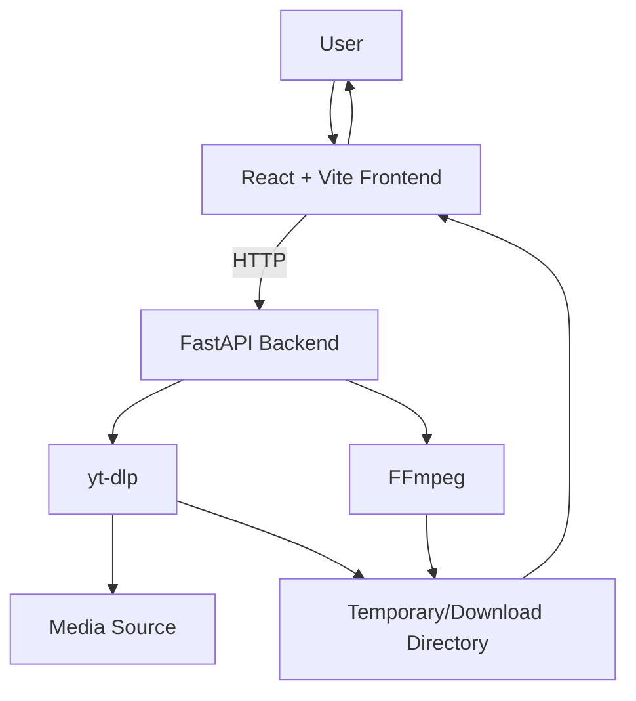

# Architecture

## 1. System Overview
A local browser-based application consisting of a React frontend and FastAPI backend. The backend invokes yt-dlp for media information/download operations and FFmpeg when media processing or merging is required.

## 2. Architecture Diagram



## 3. Application Flow
1. User opens the local frontend.
2. User enters a URL.
3. Frontend sends URL to backend.
4. Backend validates input.
5. Backend obtains media information through yt-dlp.
6. Frontend displays available options.
7. User selects a format.
8. Frontend requests the download.
9. Backend invokes yt-dlp and FFmpeg when required.
10. Progress/status is returned to the frontend.
11. Final file is saved in the configured local download directory.

## 4. User Flow
```text
Open App
  ↓
Paste URL
  ↓
Fetch Info
  ↓
Review Metadata
  ↓
Select Format
  ↓
Download
  ↓
Progress
  ↓
Completed / Error
```

## 5. Frontend Responsibilities
- Input handling.
- Form validation.
- Metadata display.
- Format selector.
- Download controls.
- Progress/status UI.
- User-friendly error messages.

## 6. Backend Responsibilities
- Validate requests.
- Call yt-dlp.
- Manage download jobs.
- Manage temporary files.
- Invoke FFmpeg when required.
- Return structured status/errors.
- Protect filesystem operations.

## 7. Downloader Flow
The backend should use yt-dlp's documented APIs/CLI capabilities rather than implementing custom extraction logic.

## 8. FFmpeg Flow
Use FFmpeg only when required for operations such as merging separate audio/video streams or supported media conversion. Keep processing local.

## 9. Error Flow
Backend errors should be converted into safe, structured responses. Frontend should display actionable messages without exposing unnecessary internal stack traces or sensitive paths.

## 10. Temporary File Flow
Temporary files should be stored in a dedicated temporary directory and removed after successful completion or failure when safe to do so.

## 11. Folder & File Structure

```text
youtube-downloader/
├── frontend/
│   ├── src/
│   │   ├── components/
│   │   ├── pages/
│   │   ├── services/
│   │   ├── types/
│   │   └── App.tsx
│   ├── package.json
│   └── vite.config.ts
├── backend/
│   ├── app/
│   │   ├── routes/
│   │   ├── services/
│   │   ├── models/
│   │   ├── utils/
│   │   └── main.py
│   ├── requirements.txt
│   └── .env.example
├── downloads/
├── temp/
├── PRD.md
├── ARCHITECTURE.md
├── RULES.md
├── PHASE.md
├── DESIGN.md
├── MEMORY.md
└── README.md
```

## 12. Technology Stack
### Frontend
- React
- Vite
- TypeScript
- Tailwind CSS

### Backend
- Python
- FastAPI

### Media
- yt-dlp
- FFmpeg

## 13. Dependencies
Only add dependencies that solve a concrete project requirement. Keep the dependency list minimal and maintained.

## 14. API Endpoints
Suggested MVP endpoints:
- `GET /api/health`
- `POST /api/info`
- `POST /api/download`
- `GET /api/download/{job_id}/status`

Exact API design may be refined during implementation.

## 15. Request/Response Flow
Use JSON for control requests/responses. Downloads may use a file response or a local-job/status model depending on the implementation.

## 16. Configuration
Configuration should include download directory, temporary directory, server host/port, and other non-secret application settings.

## 17. Environment Variables
Use `.env.example` for configurable values where appropriate. Do not store secrets that are unnecessary for the local application.

## 18. Logging
Use structured, useful application logs. Do not log unnecessary personal information, full URLs when they may contain sensitive query parameters, or excessive debug output in normal operation.

## 19. Security Considerations
- Validate all inputs.
- Avoid shell-command injection.
- Prefer subprocess argument arrays over shell interpolation when subprocesses are necessary.
- Restrict file paths.
- Sanitize output filenames.
- Limit temporary-file exposure.
- Keep the service local unless explicitly changed.
